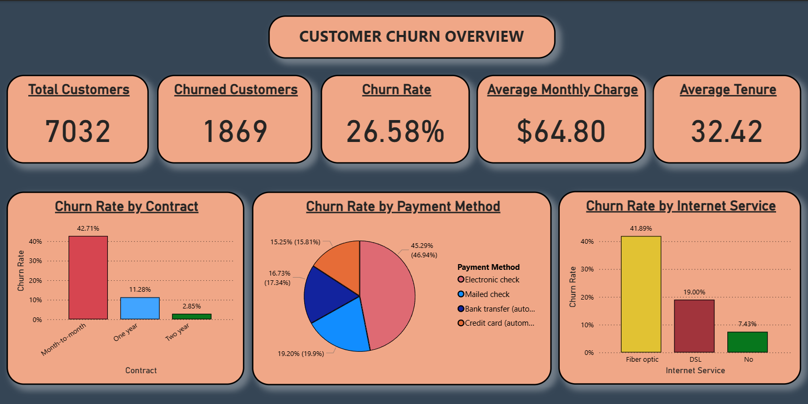
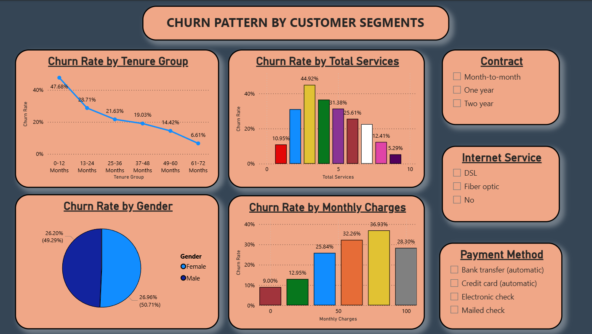

# 📊 Customer Churn Prediction

## 🧠 Introduction
This project focuses on **customer churn analysis** for a telecommunications company. Customer churn refers to the percentage of customers who discontinue their services during a specific period. By identifying churn drivers and predicting at-risk customers, businesses can implement targeted retention strategies and improve overall satisfaction.

This project integrates **SQL**, **Python**, and **Power BI** to build an **end-to-end data analytics and prediction pipeline**.

---

## ⚙️ Methodology

### 1️⃣ Data Extraction (SQL)
- Connected to the MySQL database `telco_churn`.
- Queried customer-level attributes such as demographics, tenure, contract type, payment method, internet services, and churn status.
- Ensured data quality by checking for missing values and data consistency.
- Exported the final dataset for Python-based analysis.

### 2️⃣ Data Analysis & Modeling (Python)
**Data Cleaning & Preprocessing**
- Encoded categorical variables (label + one-hot encoding).
- Scaled numerical features (`tenure`, `monthly charges`, `total charges`).
- Removed irrelevant columns like customer ID.

**Exploratory Data Analysis (EDA)**
- Overall churn rate ≈ **26.5%**
- Explored churn distribution by contract type, payment method, internet service, and tenure group.
- Visualized numeric trends and correlations.

**Machine Learning Models**
| Model | Accuracy | ROC-AUC |
|--------|-----------|---------|
| Logistic Regression | ~80% | ~0.85 |
| Random Forest | ~78.7% | ~0.82 |
| XGBoost | ~80% | ~0.85 |

- Compared performance and extracted feature importances for interpretability.
- Exported predictions and churn probabilities to CSV for visualization.

### 3️⃣ Data Visualization (Power BI)
- **Dashboard Pages:**
  - **Key Metrics:** Total Customers, Churned Customers, Churn Rate, Avg. Monthly Charges, Avg. Tenure
  - **Churn Segmentation:** By contract type, payment method, internet service, tenure, and monthly charges
- Added dynamic filters (slicers) for contract type, payment method, and service level.

---

## 📈 Results & Insights
- Customers on **month-to-month contracts** and paying via **electronic checks** had the highest churn.
- **Long-term contracts (1–2 years)** significantly reduced churn likelihood.
- Customers subscribed to **multiple services** were less likely to leave.
- **Average Monthly Charge:** $64.80  
- **Average Tenure:** ~32 months  
- Dashboard visuals made it easy to identify high-risk customer groups and retention opportunities.

---

## 🧾 Conclusion
This project successfully demonstrated an **end-to-end churn prediction framework**:
- **SQL** for extracting and validating raw data.  
- **Python** for cleaning, analyzing, and predicting churn using ML models.  
- **Power BI** for presenting insights to stakeholders.

The findings help the telecom company design **data-driven retention strategies**, reducing churn and improving profitability.

---

## 🛠️ Tech Stack
| Tool | Purpose |
|------|----------|
| **SQL (MySQL)** | Data extraction and cleaning |
| **Python (Pandas, Scikit-learn, XGBoost, Matplotlib)** | Data analysis and modeling |
| **Power BI** | Visualization and insights |

---

## 📸 Dashboard Preview

---

## 👤 Author
**Pranav Agwan**  
📧 Mail : agwanpranav123@gmail.com 

🔗 LinkedIn Profile : www.linkedin.com/in/pranav-agwan-84b80b211  
